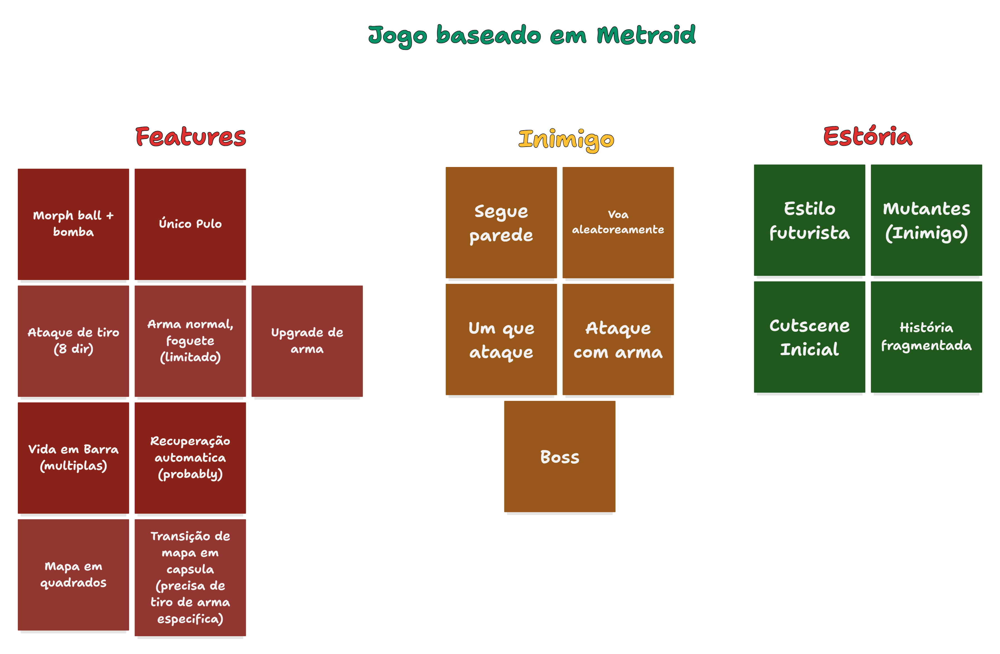
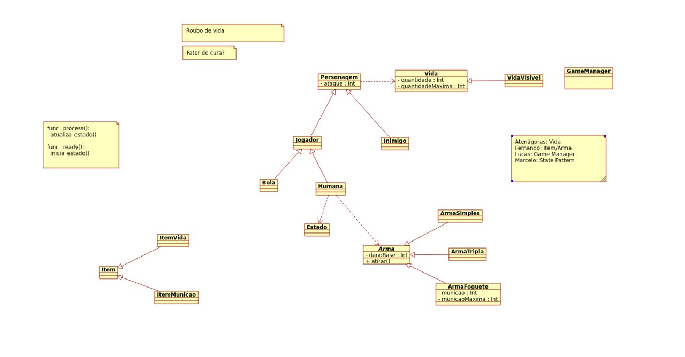

# Metroid-Like Game
Este projeto é iniciado como o trabalho solicitado pelo o curso [MAC0413/5714 - Tópicos Avançados de Programação Orientada a Objetos (2024)](https://edisciplinas.usp.br/course/view.php?id=121856) oferecido pelo IME-USP no segundo semestre do ano 2024. Neste projeto implementaremos uma versão contemporânea do jogo clássico [Metroid](https://en.wikipedia.org/wiki/Metroid) utilizando a engine livre [Godot](https://godotengine.org/), oferecendo um novo projeto gráfico e uma estória alternativa.

## Descrição do jogo
Durante o projeto implementaremos os mecânismos mais característicos do jogo clássico Metroid:

Com base nisto, construimos os diagramas de classes para ajudar o processo de desenvolvimento:

## Entrega do projeto
A entrega é dividido em múltiplas etapas:

### Fase 1
Até a primeira entrega, desenvolveremos os movimentos básicos do jogador. Tais como andar, agachar, atirar.

### Fase 2
Nesta fase, apresentaremos o padrão de projeto GoF utilizado e explicaremos a vantagem oferecida pelo padrão. E nesta fase também impletaremos a iteração do jogador com inimigos, tais como barra de vida, hitbox do inimigo.

### Fase 3
Esta é a entrega final do jogo completamente funcional,
até aqui, o código utilizará um segundo padrão de projeto GoF, além de mais dois últimos padrões, totalizando 4 padrões de projeto distintos.

## Integrantes do grupo e seus NUSP
Atenágoras Silva - 5447262

Fernando Yang - 13671744

Lucas Eiji Uchiyama - 11807470

Marcelo Spessoto

## Orientadores do projeto
Fabio Kon: Professor

Isaque Alves: Monitor
