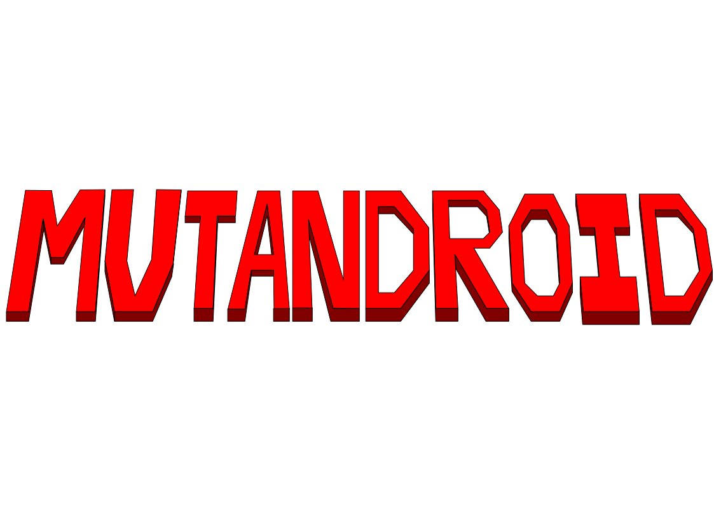
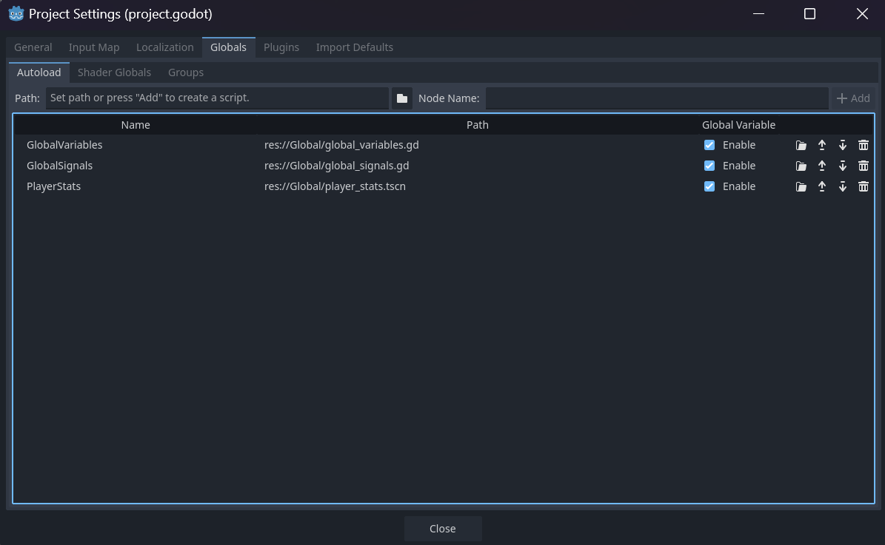
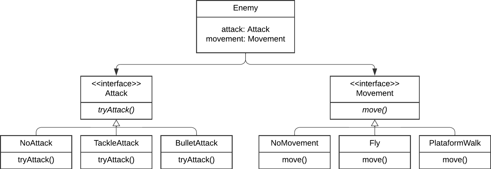

# Metroid-Like Game

Este projeto é iniciado como o trabalho solicitado pelo curso [MAC0413/5714 - Tópicos Avançados de Programação Orientada a Objetos (2024)](https://edisciplinas.usp.br/course/view.php?id=121856) oferecido pelo IME-USP no segundo semestre do ano de 2024. Neste projeto implementaremos uma versão contemporânea do jogo clássico [Metroid](https://en.wikipedia.org/wiki/Metroid) utilizando a engine livre [Godot](https://godotengine.org/), oferecendo um novo projeto gráfico e uma estória alternativa.

This project was initiated as an assignment for the course [MAC0413/5714 - Advanced Topics in Object-Oriented Programming (2024)](https://edisciplinas.usp.br/course/view.php?id=121856) offered by IME-USP in the second semester of 2024. In this project, we will implement a contemporary version of the classic game [Metroid](https://en.wikipedia.org/wiki/Metroid) using the free engine [Godot](https://godotengine.org/), offering a new graphic design and an alternative story.

<!-- ## Descrição do jogo
Durante o projeto, implementaremos os mecanismos mais característicos do jogo clássico Metroid a seguir:

Com base nisto, construímos o seguinte diagrama de classes para ajudar o processo de desenvolvimento:

**OBS: Durante o processo de desenvolvimento do jogo, muitas mudanças foram realizadas em relação às classes e o diagrama abaixo está desatualizado.
Na seção de relatório, para cada padrão implementado, haverá uma seção explicando a implementação definitiva dele, e, para a entrega final, haverá 
um novo diagrama de classes atualizado para a versão final do projeto.**

As imagens apresentadas no README estão armazenadas na pasta 'Estrutura do Jogo' -->

## Instruções de Instalação/Installation instructions
Para executar o jogo, basta instalar os arquivos contidos na pasta Game/ e executar o arquivo correspondente ao sistema operacional.

Controles:
- W, A, S, D: Movimento da Personagem, Direção da Arma
- W, S: Transformação entre estado Humano e Bola
- Space: Pular
- Shift: Atirar
- Ctrl: Trocar a Arma

---

To run the game, simply install the files located in the Game/ folder and run the file corresponding to your operating system.

Controls:

- W, A, S, D: Character Movement, Weapon Direction
- W, S: Transformation between Human and Ball forms
- Space: Jump
- Shift: Shoot
- Ctrl: Switch Weapon

## Cronograma do projeto/Project schedule
A entrega é dividida em múltiplas etapas:

### Fase 1
Desenvolvemos os movimentos básicos do jogador, tais como andar, atirar, saltar, alternar entre as formas humana e bola. Como criamos o jogo através da engine Godot, a parte gráfica já começou a ser desenvolvida, e temos um protótipo minimamente funcional.

### Fase 2
Nesta fase, apresentaremos os padrões de projeto GoF utilizados até agora e explicaremos a vantagem oferecida pelo padrão. E nesta fase também implementaremos a interação do jogador com inimigos, tais como barra de vida, hitbox do inimigo e do jogador, mudança de arma, dentre outras features. Também adicionaremos a história ao jogo (cutscene inicial e demais apresentações da história) e criaremos a estrutura do mundo e os itens coletáveis. 

### Fase 3
Esta é a entrega final do jogo completamente funcional.
Até aqui, o código deverá utilizar ao menos 4 padrões de projeto distintos. Nesta fase, deverá ser implementada a tela inicial e serem criados testes automatizados para as classes. Adicionaremos músicas e efeitos sonoros nesta última fase também. A maior parte do mapa deverá estar pronta na fase 2, mas ele estará pronto ao final da fase 3. Também o chefe final do jogo (boss) será criado nesta fase.

Dividimos as ações a serem realizadas com base nas fases, e atribuímos cada feature a ser criada a uma delas, como visto na parte de issues do projeto.

---

The delivery is divided into multiple stages:

### Phase 1
We developed the player's basic movements, such as walking, shooting, jumping, and switching between human and ball forms. Since we created the game using the Godot engine, the graphics have already begun development, and we have a minimally functional prototype.

### Phase 2
In this phase, we will present the GoF design patterns used so far and explain the advantage offered by the pattern. In this phase, we will also implement player interaction with enemies, such as health bars, enemy and player hitboxes, weapon switching, among other features. We will also add the story to the game (initial cutscene and other story presentations) and create the world structure and collectible items.

### Phase 3
This is the final delivery of the fully functional game.

Up to this point, the code should use at least 4 distinct design patterns. In this phase, the initial screen should be implemented, and automated tests for the classes should be created. We will also add music and sound effects in this final phase. Most of the map should be ready in phase 2, but it will be finished by the end of phase 3. The final boss of the game will also be created in this phase.

We divided the actions to be performed based on the phases, and assigned each feature to be created to one of them, as seen in the project's issues section.

## Fase 1/Phase 1

Na fase 1, implementamos o padrão de estado (state) no nosso projeto. Também conseguimos criar assets para o player e para o mundo, porém alguns ainda não foram adicionados ao jogo. Conseguimos fazer o movimento básico, alternando as formas de movimentação do personagem, com o uso do padrão estado.

### Padrão de estados (State pattern)

O padrão de estados foi utilizado para a implementação do movimento do jogador. O jogador possui uma relação de dependência com a classe State que, por sua vez realiza uma relação de associação com a StateManager. 

#### StateManager

A classe StateManager é bem simples e define a função switch_state. Tal método é responsável por definir o current_state. Nas funções built-in _ready e _process do Godot, a classe StateManager, respectivamente, inicializa e atualiza o current_state. 

#### State 

A classe State possui acesso ao seu respectivo StateManager, ao corpo do jogador, ao gerenciador de animações do jogador e ao braço do jogador. Define os métodos update_state e init_state. 

Essa classe, por sua vez, é especializada em subclasses IdleState, WalkState, JumpState que representam, respectivamente, os estados de jogador parado, andando e pulando.

No momento atual, esses estados simplesmente gerenciam animações de jogador conforme o estado, mas a lógica de movimentação permanece concentrada no código do jogador, pois parte da lógica de cada estado é utilizada por outros estados. Por exemplo, enquanto pula, um jogador pode se deslocar horizontalmente e utilizar a lógica do estado Andando. 

Entretanto, a adoção de tal padrão ainda é interessante para o projeto visando uma manutenção a longo prazo, pois os estados podem gerenciar outros aspectos além da animação do jogador. É comum em jogos, por exemplo, que alguns atributos do jogador sejam diferentes entre estados. Em um balanceamento do jogo, pode se tornar desejável que o deslocamento horizontal do jogador tenha velocidade diferente quando ele está simplesmente andando ou quando ele está no ar (no meio de um pulo ou queda). O valor momentâneo de um atributo é algo que pode ser gerenciado pelo estado. 

Em resumo, conforme a complexidade de um jogo aumenta, os estados tendem a possuirem maiores especificidades e propriedades únicas. No estado atual do projeto, a adoção do padrão auxilia no gerenciamento de animações e facilita a adição de futuras funcionalidades. Outra observação é que a habilidade de atirar está sendo implementada por outro membro do grupo e com base no padrão Estratégia, mas, em um momento no futuro, espera-se incorporar a lógica de tiro em um novo estado.

Observação: Esse diagrama representa como o padrão foi implementado via script. Em Godot, existe a separação entre cenas/nós e scripts (código atribuído ao nó). Na cena do jogador, o nó do jogador "contém" o nó do StateManager (ou seja é nó pai do nó StateManger), mas, por código, não há interação direta entre essas classes. 

---

In phase 1, we implemented the state pattern in our project. We also managed to create assets for the player and the world, although some have not yet been added to the game. We managed to implement basic movement, alternating the character's movement patterns, using the state pattern.

### State Pattern

The state pattern was used to implement player movement. The player has a dependency relationship with the State class, which in turn has an association relationship with the StateManager.

#### StateManager

The StateManager class is quite simple and defines the switch_state function. This method is responsible for defining the current_state. In Godot's built-in _ready and _process functions, the StateManager class initializes and updates the current_state, respectively.

#### State

The State class has access to its respective StateManager, the player's body, the player's animation manager, and the player's arm. This class defines the `update_state` and `init_state` methods.

This class, in turn, is specialized into subclasses `IdleState`, `WalkState`, and `JumpState`, which represent, respectively, the player states of standing still, walking, and jumping.

Currently, these states simply manage player animations according to the state, but the movement logic remains concentrated in the player code, as part of the logic of each state is used by other states. For example, while jumping, a player can move horizontally and use the logic of the Walking state.

However, adopting this pattern is still interesting for the project for long-term maintenance, as states can manage other aspects besides player animation. It is common in games, for example, for some player attributes to be different between states. In game balancing, it may be desirable for the player's horizontal movement to have a different speed when they are simply walking or when they are in the air (in the middle of a jump or fall). The momentary value of an attribute is something that can be managed by the state.

In summary, as the complexity of a game increases, states tend to possess greater specificity and unique properties. In the current state of the project, the adoption of the pattern assists in managing animations and facilitates the addition of future functionalities. Another observation is that the ability to shoot is being implemented by another member of the group and based on the Strategy pattern, but, at some point in the future, it is expected to incorporate the shooting logic into a new state.

Note: This diagram represents how the pattern was implemented via script. In Godot, there is a separation between scenes/nodes and scripts (code assigned to the node). In the player scene, the player node "contains" the StateManager node (i.e., it is the parent node of the StateManager node), but, by code, there is no direct interaction between these classes.

## Fase 2/Phase 2

Na fase 2, utilizamos o padrão estratégia (strategy) para facilitar a troca de armas. A máquina de estados, nesta fase, está mais completa que a anterior, tendo implementado a alternância entre as formas humana e bola. Começamos a criar os inimigos do jogo nesta fase, mas ainda não os havíamos adicionado nele.

### Padrão de Fábrica (Factory pattern)
Como os diferentes armas possuem os mesmos métodos que podem ser acessadas pelas outras classes, foi aplicado o padrão de fábbrica junto com de estratégia a fim de evitar o uso dos desvios condicionais para identificação do tipo de arma, com isso foi possível diminuir a repetição de código e consequentemente facilitar a sua leitura e entendimento.

### Atualizações no padrão de Estados (State Pattern)

Durante a fase 1, o padrão de estados foi implementado, como descrito acima. Entretanto, mudanças foram adotadas durante a parte 2 para adicionar incrementar o jogo.

O projeto é inspirado na série de jogos Metroid, em que a personagem principal possui, como uma de suas habilidades mais icônicas, a capacidade de 
alternar de formas: forma antropomórfica e forma de "bola". A primeira é a forma padrão e "humana", em que a personagem pode ficar parada, atirar, pular e andar. Na segunda forma, a personagem fica menor e pode acessar áreas estreitas, mas também pode ficar parada e andar. Com pequnas variações, pode também pular após o desbloqueio da habilidade de pulo para essa forma e lançar bombas (do ponto de vista de impementação, é um "tiro" que adota outra estratégia do padrão Estratégia).

Repare que ambas as formas compartilham uma máquina de estados quase idêntica. Criar estados "bolaIdle", "bolaWalk", "bolaJump" seria extremamente redundante. A solução para incorporar essa mecânica de jogo com o padrão de estados foi a adoção de máquinas de estados concorrentes. Existem dois StateManager agora. O primeiro StateManger é o descrito na fase 1. O segundo StateManager é um gerenciador de estados que gerencia dois estados: os novos estados humana e bola. Esses estados, quando aplicados (ou seja, durante a execução do método init_state), definem os novos sprites de idle, walking, jumping do gerenciador de animações do personagem, a nova hitbox e (ainda não implementado, mas planejado para a entrega), a nova estratégia de tiro, de acordo com o novo estado.

---

In phase 2, we used the strategy pattern to facilitate weapon switching. The state machine, in this phase, is more complete than the previous one, having implemented the alternation between human and ball forms. We started creating the game's enemies in this phase, but we hadn't yet added them to the game.

### Factory Pattern
Since the different weapons have the same methods that can be accessed by other classes, the factory pattern was applied along with the strategy pattern in order to avoid the use of conditional branches to identify the weapon type. This made it possible to reduce code repetition and consequently facilitate its reading and understanding.

### Updates to the State Pattern

During phase 1, the state pattern was implemented as described above. However, changes were adopted during part 2 to enhance the game.

The project is inspired by the Metroid game series, in which the main character possesses, as one of its most iconic abilities, the capacity to switch between forms: anthropomorphic form and "ball" form. The first is the standard and "human" form, in which the character can stand still, shoot, jump, and walk. In the second form, the character becomes smaller and can access narrow areas, but can also stand still and walk. With slight variations, it can also jump after unlocking the jump ability for this form and launch bombs (from an implementation point of view, it's a "shot" that adopts a different strategy from the Strategy pattern).

Note that both forms share an almost identical state machine. Creating "ballIdle", "ballWalk", "ballJump" states would be extremely redundant. The solution to incorporate this game mechanic with the state pattern was the adoption of concurrent state machines. There are two StateManagers now. The first StateManager is the one described in phase 1. The second StateManager is a state manager that manages two states: the new human and ball states. These states, when applied (i.e., during the execution of the init_state method), define the new idle, walking, and jumping sprites of the character animation manager, the new hitbox, and (not yet implemented, but planned for delivery) the new shooting strategy, according to the new state.

## Fase 3/Phase 3

Nesta fase, o jogo está quase concluído, com a maioria das funcionalidades planejadas já implementadas. Entre elas, destacam-se a interação do jogador com inimigos e o ambiente, power-ups que desbloqueiam habilidades no jogo, a inclusão do mapa onde a ação se desenvolve, entre outros recursos. Além disso, foram introduzidos dois novos padrões no jogo, que são:

### Padrão de Singleton

Sendo uma das funcionalidades oferecidas pela engine Godot, não foi necessário implementar nosso próprio código para utilizar este padrão. Para isso, basta adicionar a classe que desejamos usar como Singleton na seção correspondente da engine. Assim, ela pode ser acessada de forma única em todo o jogo:

### Padrão de Estratégia (Strategy Pattern)

Os inimigos do jogo podem apresentar diversos tipos de movimento e ataque contra o jogador, sendo muitas vezes idênticos entre si em certos aspectos. Para evitar a repetição de código, utilizamos o padrão de estratégia, permitindo selecionar os componentes que definem o comportamento de um tipo específico de inimigo, como ilustrado no diagrama abaixo:

### Diagrama final

Após as fases de desenvolvimento, o diagrama do nosso jogo tornou-se mais completo e detalhado em comparação com o protótipo criado no início do projeto. Ele está estruturado da seguinte forma:

---

At this stage, the game is almost complete, with most of the planned features already implemented. Among these, the player's interaction with enemies and the environment, power-ups that unlock in-game abilities, the inclusion of the map where the action takes place, and other features stand out. In addition, two new patterns have been introduced into the game:

### Singleton Pattern

Being one of the features offered by the Godot engine, it was not necessary to implement our own code to use this pattern. To do this, simply add the class you want to use as a Singleton to the corresponding section of the engine. Thus, it can be accessed uniquely throughout the game:

### Strategy Pattern

The game's enemies can exhibit various types of movement and attacks against the player, often being identical to each other in certain aspects. To avoid code repetition, we used the strategy pattern, allowing us to select the components that define the behavior of a specific enemy type, as illustrated in the diagram below:

### Final Diagram

After the development phases, our game diagram became more complete and detailed compared to the prototype created at the beginning of the project. It is structured as follows:

## Integrantes do grupo/Group members
Atenágoras Silva - 5447262

Fernando Yang - 13671744

Lucas Eiji Uchiyama - 11807470

Marcelo Mendes Spessoto Junior - 12542380

## Orientadores do projeto/Project orientators
Fabio Kon: Professor

Isaque Alves: Monitor

## Créditos/Credits
SpaceStationAda - Jestan
sci-fi blade runner/terminator-like ominous dytopian tense dark thriller horror sfx  - Simonus18
